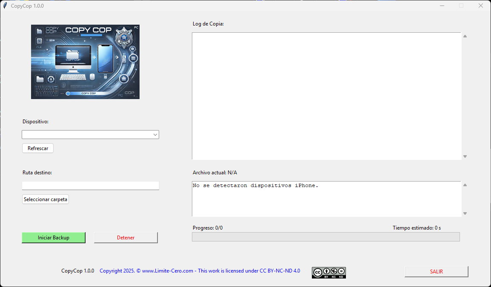

# CopyCop 

The easiest and fastest way to copy your photos and videos from your iPhone to your PC without hassle.

**CopyCop** is an automated backup tool for iPhone devices on Windows. It allows you to securely and efficiently copy images and videos from the `DCIM` folder of a connected iPhone to a local folder.
Initially designed for those who have experienced device I/O errors while copying files from an iPhone to a PC or random interruptions during the file transfer, making the copying process difficult and requiring it to be done in parts

## Features
- Automatic detection of connected iPhone devices.
- Recursive file copying from `DCIM`.
- Checkpoint-based verification and resumption of interrupted backups.
- User-friendly graphical interface with a progress bar.
- Option to stop the copying process at any time.
- If the program detects an error and is interrupted, it resumes from the point where it left off.
- It can copy 128 GB in approximately 100 minutes on a mid-performance computer.

## Requirements
- Windows 10/11
- Python 3.8+

## Installation and Usage
1. Connect your iPhone to the PC and make sure it is detected by Windows Explorer.
2. Run the `copycop.exe` program.
3. Select the device and the destination folder.
4. Press the 'Iniciar Backup' button and wait while the program indexes the remote device files before beginning the backup process.

## Screenshot

## ☕ Sponsor Me

If you find this tool useful and want to support its development:

## License
This project is licensed under [CC BY-NC-ND 4.0](https://creativecommons.org/licenses/by-nc-nd/4.0/legalcode).
